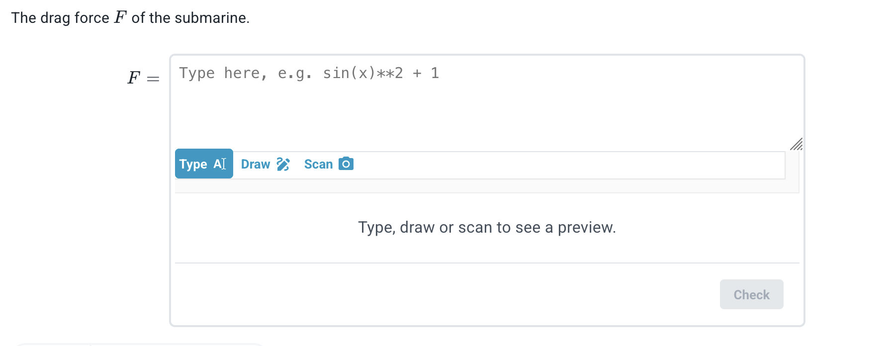
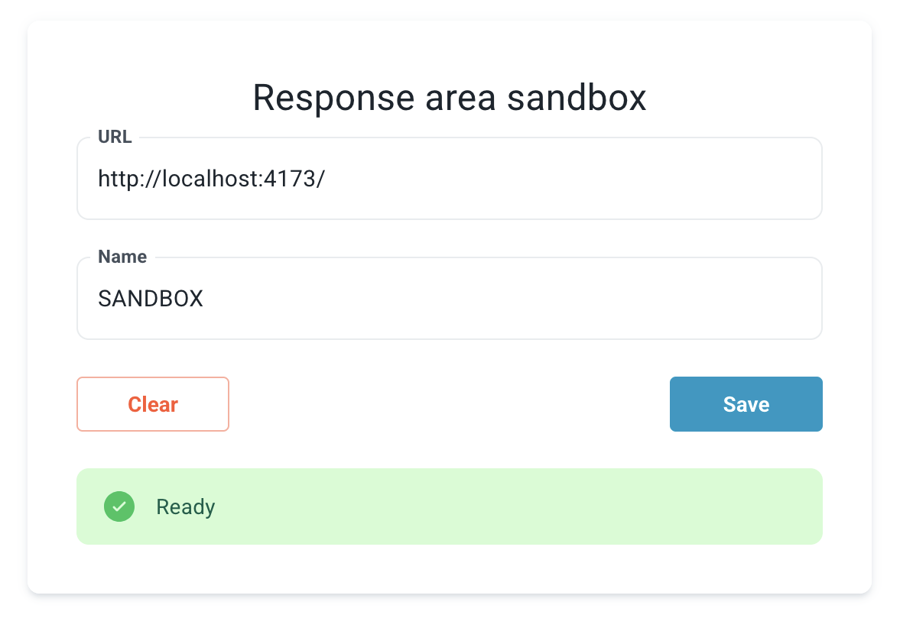
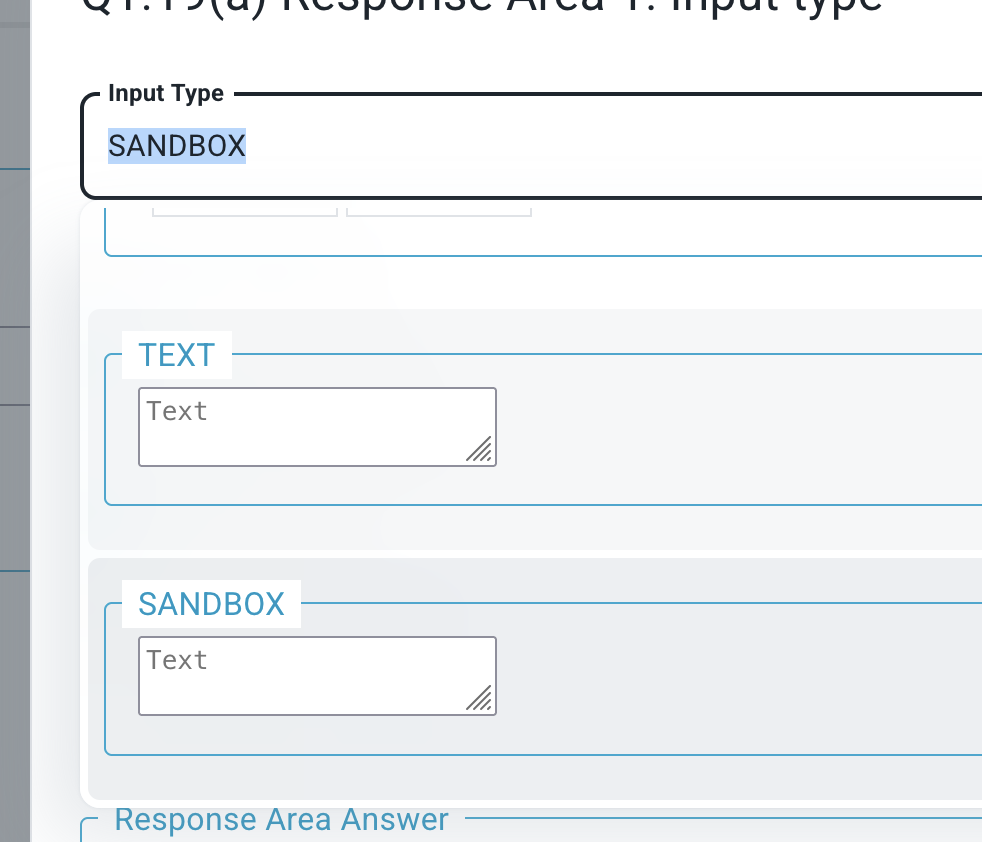

# Response Area Sandbox

## Overview

This sandbox lets you build a custom Response Area and preview it live inside the Lambda Feedback app. When it's ready, you send your code to the Lambda Feedback team for review and potential inclusion in the main application.



To create a new type, you'll:

1. **Copy the Sandbox template** — duplicate `src/types/Sandbox/` and rename it after your type
2. **Build your Response Area** — edit the components in your new folder to create the interface students and teachers will see
3. **Preview it live** — the sandbox dev server injects your code into the Lambda Feedback app so you can test it in real time

**📚 For detailed technical documentation, see the inline code comments in [response-area-tub.ts](src/types/response-area-tub.ts) and [base-props.type.ts](src/types/base-props.type.ts) — these will also appear in your code editor's autocomplete and hover tooltips.**

The existing types in `src/types/` are good examples to learn from — it's fine to copy code from them to get started.

See also: [Lambda Feedback user documentation](https://lambda-feedback.github.io/user-documentation/advanced/)

## Development

### Prerequisites

Before you begin, make sure you have the following:

- **Basic knowledge of TypeScript or JavaScript** — you'll be writing and editing code to build your Response Area. If you're new to TypeScript, [this introduction](https://www.typescriptlang.org/docs/handbook/typescript-in-5-minutes.html) is a good starting point
- **Git** — for downloading the code. [Install Git](https://git-scm.com/downloads)
- **A code editor** — [Visual Studio Code](https://code.visualstudio.com/) is recommended if you don't have one
- **A Lambda Feedback account with Teacher access** — you'll need this in Step 7. Contact [mmmeser@imperial.ac.uk](mailto:mmmeser@imperial.ac.uk) if you don't have it yet

### Setup locally

##### 1. Fork and download this repository

First, you'll need a free [GitHub account](https://github.com) if you don't have one. Then fork the repository to your own GitHub account by clicking **Fork** at the top of [this page](https://github.com/lambda-feedback/response-area-sandbox).

Then download your fork — choose whichever method you prefer:

**Option A — GitHub Desktop** (recommended for beginners): Open [GitHub Desktop](https://desktop.github.com/), sign in, and clone your forked repository from there.

**Option B — Terminal**:
```sh
git clone https://github.com/YOUR_USERNAME/response-area-sandbox.git
cd response-area-sandbox
```
Replace `YOUR_USERNAME` with your GitHub username.

##### 2. Install Node

If you haven't used Node before, download and install the **LTS** version from [nodejs.org](https://nodejs.org).

If you already manage multiple Node versions, you can use [Nodenv](https://github.com/nodenv/nodenv) or [NVM](https://github.com/nvm-sh/nvm) instead.

##### 3. Install Yarn and packages

In VS Code, open a terminal via **Terminal → New Terminal** in the menu bar. Then run the following commands:

```
npm install --global yarn
yarn
```

The first command installs Yarn (a package manager). The second installs the project's dependencies.

##### 4. Create your new type

**a) Copy the Sandbox folder**

Duplicate the folder `src/types/Sandbox/` and rename the copy after your type (e.g. `src/types/<YourType>/`). This is your starting point — all your code will live here.

In VS Code, right-click the `Sandbox` folder in the Explorer panel and select **Copy**, then right-click the `types` folder and select **Paste**. Rename the pasted folder to your type name. On Mac Finder, you can right-click → **Duplicate** instead. On Windows Explorer, right-click → **Copy**, then right-click an empty area → **Paste**.

**b) Point the dev server at your new folder**

Open `src/sandbox-component.tsx` in your code editor and update line 2 to import from your new folder. Only change the path — leave `SandboxResponseAreaTub` as-is:

```
import { SandboxResponseAreaTub } from './types/<YourType>/index'
```

**c) Set your type's name**

Open `src/types/<YourType>/index.ts` and find the line:

```
public readonly responseType = 'SANDBOX'
```

Replace `SANDBOX` with your chosen name in UPPER_CASE (e.g. `YOUR_TYPE`). This name must be unique — don't use a name already used by another type in the repo.

> ⚠️ **Remember this name** — you will need to enter it exactly (including capitalisation) in Step 6.

##### 5. Run the dev server

```sh
yarn dev 
```

This will serve your new Response Area as a compiled JavaScript file.

Once running, your terminal will show something like:

```
  ➜  Local:   http://localhost:4173/
```

Note down the **Local** URL — you'll need it in Step 6.

##### 6. Configure the sandbox access on the app

Log in to [lambdafeedback.com](https://www.lambdafeedback.com) first, then go to [Settings → Sandbox](https://www.lambdafeedback.com/settings/sandbox). Fill in:
- **URL**: the Local URL from Step 5
- **Name**: the name you set in Step 4c (default: `SANDBOX`). This must match exactly, including capitalisation.

Click **Save**. The settings are stored in your browser.

You should see a **'Ready'** message — you can then move on to Step 7.



If you see an error instead, check:
- the URL matches what was shown in Step 5
- the dev server from Step 5 is still running in your terminal

##### 7. Check it works, and begin developing

You will need Teacher access to test this — if you don't have it yet, contact [mmmeser@imperial.ac.uk](mailto:mmmeser@imperial.ac.uk).

1. Select a module you are a teacher on. We suggest using a teacher sandbox module — if you don't have one, let us know at [mmmeser@imperial.ac.uk](mailto:mmmeser@imperial.ac.uk)
2. Select a question set, then a question, then click **Add Response Area**
3. In the input type dropdown, you should see your type (the name you set in Step 4c) as an option



For more guidance on navigating the Lambda Feedback interface, see the [Lambda Feedback user documentation](https://lambda-feedback.github.io/user-documentation/advanced/).

Try editing your Response Area — open `src/types/<YourType>/SandboxInput.component.tsx` in your code editor and make a small change, such as editing a text label. You should see it update in real time (every 0.5s) in your browser.

### Troubleshooting

##### 0. How to open the browser console

Press **F12** (or **Cmd+Option+J** on Mac) to open the browser developer tools, then click the **Console** tab.

##### 1. Sandbox component is not loading

Open the browser console and check for any error messages.

##### 2. Sandbox component stopped refreshing

Reload the page.
If it keeps happening, open the browser console and check for error messages.

##### 3. A `[VOID]` component is shown

The response area type isn't available. This could be because:
- the dev server from Step 5 has stopped — return to Step 5 and run it again
- the type's name was changed — make sure the name in Step 4c matches the name in Step 6

##### 4. `Error: Could not extract config` or `Error: Could not extract answer`

This happens when you change the structure of your config or answer after already creating or answering response areas using the old structure. This isn't supported.

To fix this, undo your structural changes and delete any response areas created with the old structure before making the change again.

## Next Steps

### Understanding the code structure

Your Response Area lives in `src/types/<YourType>/`. The key files are:

- **`index.ts`** — defines the name of your type, the settings it exposes, and how student answers are stored
- **`SandboxInput.component.tsx`** — the UI that students and teachers will see

Start by editing `SandboxInput.component.tsx`. For full details on what you can build, see the inline code comments in [response-area-tub.ts](src/types/response-area-tub.ts) — these explain everything available to you as you build your Response Area.

The existing types in `src/types/` are good examples to learn from — it's fine to copy code between them.

### Submitting your work

When your Response Area is ready, open a Pull Request against the `main` branch of [this repository](https://github.com/lambda-feedback/response-area-sandbox). The Lambda Feedback team will review it and get back to you.

If you're new to Pull Requests, [GitHub's guide](https://docs.github.com/en/pull-requests/collaborating-with-pull-requests/proposing-changes-to-your-work-with-pull-requests/creating-a-pull-request) walks you through the process.

### Getting help

- For questions about the sandbox or the submission process, contact [mmmeser@imperial.ac.uk](mailto:mmmeser@imperial.ac.uk)
- For guidance on the Lambda Feedback app, see the [Lambda Feedback user documentation](https://lambda-feedback.github.io/user-documentation/advanced/)

### Note to LLM helpers

This sandbox works as follows. A production application runs in the browser, connected to a cloud-based backend. This sandbox repo runs a local server and serves up compiled js (but not a full web page). 

If the /sandbox/settings page on the app is updated, locally in the broswer, with the correct local URL for the server that this repo creates, then - only on the local machine, in the same browser - the locally-served, compiled js will be used directly within the app. 

Therefore, do not look for locally served web pages when debugging as they shouldn't be there. This repo does not serve a website.
